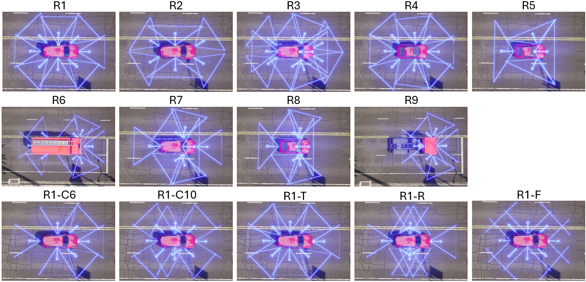

# Generating PCCR

This folder hosts the generation framework for PCCR: multi-rig 3D perception using CARLA 0.9.16. 
Generates nuScenes-like datasets with configurable camera rigs, LiDAR, 3D annotations, and CAN bus data.



## File Structure

Core layout (most frequently used paths):

```text
pccr/
  configs/
    scenes.json            # generated scene definitions (split/map/weather/spawn)
    rigs/*.json            # camera+lidar rig presets (R1, R1-c6, R2, ...)
  core/
    generate_scenes.py     # create randomized scenes.json
    record_trajectories.py # one-time deterministic actor trajectory recording
    scene_runner.py        # main CARLA capture loop -> nuScenes-style data
    prune_trajectories.py  # optional trajectory balancing/filtering
  lib/                     # shared implementation (annotation, bbox, io, utils)
  tools/
    data/                  # pkl generation + stats + conversion helpers
    debug/                 # interactive/debug utilities
    viz/                   # visualization tools (samples, can bus, lidar, spawn points)
  scripts/                 # wrapper scripts for multi-step or looped runs
  env/                     # CARLA and mmdet3d environment definitions
  output/                  # user-created output (trajectories, captured data, debug exports)
```

Typical generation flow uses `core/generate_scenes.py`, `core/record_trajectories.py`, and then `core/scene_runner.py`; data conversion and inspection happen afterward under `tools/data` and `tools/viz`.


## Installation

All environment files live in the `env/` folder. There are three setup options depending on your use case.

### Part A — Generating CARLA data

Install [CARLA 0.9.16](https://github.com/carla-simulator/carla/releases/tag/0.9.16) separately, then install the Python dependencies:

```bash
pip install -r env/requirements.carla.txt
```

We used Python 3.10.12 for development.

Before running any script, point `CARLA_ROOT` at your CARLA installation:

```bash
export CARLA_ROOT=/path/to/CarlaUE4-0.9.16-prebuilt
```

### Part B - .pkl Generation Using MMDetection3D

`env/Dockerfile.mmdet3d` sets up PyTorch 1.10 + mmengine for the `.pkl` creation pipeline. Run the post-create script inside the container to compile CUDA ops:

```bash
docker build -f env/Dockerfile.mmdet3d -t pccr-mmdet3d .
```

Or use the VSCode devcontainer (`.devcontainer/`), which builds the image and runs [`.devcontainer/postcreate.sh`](.devcontainer/postcreate.sh) automatically.

> **Note:** The mmdet3d environment is only needed for creating `.pkl` files, not for running the CARLA dataset generation.

## Quick Start

Here we describe the core commands for generating the multi-rig dataset.

To actually replicate the PCCR benchmark, please run the `record_trajectories_and_run_scenes.sh` script in env A, followed by the `create_data_loop.sh` script in env B.

### 1. Generate Scene Configurations

```bash
python3 core/generate_scenes.py --output configs/scenes.json
```

### 2. Record Trajectories (One-time)

Record traffic/pedestrian trajectories for deterministic replay:

```bash
python3 core/record_trajectories.py \
  --output output/trajectories \
  --scenes configs/scenes.json \
  --split mini
```

### 3. Run Scenes with Camera Rig

Generate the dataset with a specific camera configuration:

```bash
python3 core/scene_runner.py \
  --output output/data \
  --scenes configs/scenes.json \
  --camera-rigs configs/rigs/R1.json configs/rigs/R2.json  \
  --trajectories output/trajectories \
  --split mini
```

### 4. Create .pkl files for mmdetection3d training
Inside the docker container or devcontainer, run:
```bash
python3 tools/data/create_data.py \
  --save-folder output/data \
  --version v1.0-mini \
  --no-lidar
```

or on an external SSD / using special pathing for transfering (you need to set the correct volume mounts in the docker / devcontainer):

```bash
python3 tools/data/create_data.py \
  --save-folder /data/R3 \
  --root-path /data/R3 \
  --version v1.0 \
  --no-lidar
```

to create mixed pkl files from multiple rigs with:

```bash
python3 tools/data/create_data_mixed.py \
  --root-dir /data \
  --rigs R1 R1-c6 R1-c10 R1-f R1-r R1-t \
  --version v1.0-trainval \
  --out-dir /data/R_mixed_control \
  --no-lidar
```
or
```bash
python3 tools/data/create_data_mixed.py \
  --root-dir /data \
  --rigs R1 R2 R3 R4 R5 R6 \
  --version v1.0-trainval \
  --out-dir /data/R_mixed_123456 \
  --no-lidar
```
This uses round-robin sampling from the specified rigs to keep scenes unique, resulting in a dataset with similar size as a single rig.


## Tools Reference
Ordered by recommended workflow.

### show_spawnpoints.py

Displays available spawn points in the current CARLA map.

```bash
python3 tools/viz/show_spawnpoints.py
```

### interactive_sensor_tool.py

Interactive tool for positioning cameras and LiDAR on a vehicle.

```bash
python3 tools/debug/interactive_sensor_tool.py
```

**Controls:**
- `W/S/A/D/Q/E` - Move sensor (forward/back/left/right/up/down)
- `Arrow keys` - Rotate camera (pitch/yaw)
- `1-9, 0, -, =` - Select camera
- `L` - Select LiDAR
- `Ctrl+S` - Save configuration
- `Ctrl+L` - Load configuration
- `C` - Capture images
- `ESC` - Exit

To load a configuration, there must be a `sensor_config.json` file in the current directory.
Saved configurations will be written to `sensor_config.json`.

### generate_scenes.py

Generates scene configuration file with spawn points and weather conditions.

```bash
python3 core/generate_scenes.py --output configs/scenes.json
```

### record_trajectories.py

Records traffic and pedestrian movements for deterministic scene replay. 
Uses the largest vehicle (firetruck) as ego vehicle by default so replaying with other vehicles does not cause collisions.

```bash
# Record all mini split scenes
python3 core/record_trajectories.py \
  --output output/trajectories \
  --scenes configs/scenes.json \
  --split mini

# Record with custom settings
python3 core/record_trajectories.py \
  --output output/trajectories \
  --scenes configs/scenes.json \
  --split trainval \
  --limit 10 \
  --max-pedestrians 50 \
  --debug
```

| Option | Description |
|--------|-------------|
| `--output` | Output directory for trajectory HDF5 files |
| `--scenes` | Path to scenes.json configuration |
| `--split` | Dataset split to record |
| `--limit` | Limit number of scenes |
| `--max-pedestrians` | Max pedestrians per scene (default: 100) |
| `--debug` | Enable debug logging |


### scene_runner.py

Main tool for dataset generation. Executes CARLA scenes and exports nuScenes-format data.

```bash
python3 core/scene_runner.py \
  --output output/data \
  --scenes configs/scenes.json \
  --camera-rigs configs/rigs/R1.json configs/rigs/R2.json \
  --trajectories output/trajectories \
  --split mini \
  --version v1.0 \
  --limit 5 \
  --max-detection-distance 80.0 \
  --debug \
  --no-lidar
```

| Option | Description |
|--------|-------------|
| `--output` | Output directory for dataset |
| `--scenes` | Path to scenes.json configuration |
| `--camera-rigs` | Camera rig JSON files (can specify multiple) |
| `--trajectories` | Directory with pre-recorded trajectory files |
| `--split` | Dataset split: trainval, test, mini |
| `--version` | Version tag for annotation folder (default: v1.0) |
| `--limit` | Limit number of scenes to process |
| `--max-detection-distance` | Max annotation distance in meters (default: 80) |
| `--debug` | Show debug bounding boxes in CARLA |
| `--no-lidar` | Disable LiDAR sensor |


### annotation_debug_tool.py

Interactive validator for live annotation debugging. It loads a specific map, spawn point, and rig; spawns ego, traffic, and pedestrians on autopilot; supports pausing the simulation; captures raw sensor outputs plus projected annotation overlays; and can toggle CARLA-side debug boxes while the scene is running.

```bash
python3 tools/debug/annotation_debug_tool.py \
  --map Town01 \
  --spawn-point 86 \
  --camera-rig configs/rigs/R1.json \
  --weather ClearNoon \
  --traffic-density 0.3 \
  --max-pedestrians 40 \
  --output output/debug \
  --show-debug-boxes
```

```bash
python3 tools/debug/annotation_debug_tool.py \
  --map Town01 \
  --spawn-point 228 \
  --camera-rig configs/rigs/R1.json \
  --trajectory-file output/trajectories/mini/mini_01.h5
```

**Controls:**
- `SPACE` - Pause / resume simulation
- `C` - Capture current frame
- `N` - Single-step one frame while paused
- `B` - Toggle CARLA debug bounding boxes
- `H` - Toggle help overlay
- `ESC` - Exit

Each capture writes:
- raw RGB images under `samples/<CAM_NAME>/`
- overlay images under `overlays/<CAM_NAME>/`
- optional depth debug PNGs under `debug_depth/<CAM_NAME>/`
- optional LiDAR under `samples/LIDAR_TOP/`
- per-capture JSON records under `captures/`
- aggregated nuScenes-style tables under the versioned annotation folder


### visualize_sample.py

Visualizes a sample with 3D bounding box projections on camera images.

```bash
# Visualize by sample index
python3 tools/viz/visualize_sample.py output/data/R1 --sample-idx 0 --output vis/

# Visualize by sample token
python3 tools/viz/visualize_sample.py output/data/R1 --sample-token abc123... --output vis/
```

### visualize_canbus.py

Verifies and visualizes CAN bus data for a scene.

```bash
# List available scenes
python3 tools/viz/visualize_canbus.py output/data/R1 --list

# Verify a specific scene
python3 tools/viz/visualize_canbus.py output/data/R1 --scene mini_01

# Show all plots
python3 tools/viz/visualize_canbus.py output/data/R1 --scene mini_01 --plot

# Show route map (bird's eye view)
python3 tools/viz/visualize_canbus.py output/data/R1 --scene mini_01 --route

# Save plots to directory
python3 tools/viz/visualize_canbus.py output/data/R1 --scene mini_01 --save output/plots/

# Verify all scenes
python3 tools/viz/visualize_canbus.py output/data/R1 --all
```

### visualize_lidar_scan.py

Visualizes a LiDAR point cloud as 2D top-down view.

```bash
# Display LiDAR scan
python3 tools/viz/visualize_lidar_scan.py output/data/R1/samples/LIDAR_TOP/scan.pcd.bin

# Save to file
python3 tools/viz/visualize_lidar_scan.py output/data/R1/samples/LIDAR_TOP/scan.pcd.bin \
  --save output/lidar_vis.png --dpi 150 --no-show
```

## Camera Rig Configuration

Camera rigs are defined in JSON format:

```json
{
  "vehicle_type": "vehicle.audi.etron",
  "cameras": [
    {
      "id": "CAM_FRONT",
      "location": [2.0, 0.0, 1.5],
      "rotation": [0, 0, 0],
      "fov": 65
    }
  ],
  "lidar": {
    "id": "LIDAR_TOP",
    "location": [0.0, 0.0, 1.8],
    "rotation": [0, 0, 0],
    "channels": 32,
    "range": 100.0,
    "points_per_second": 1390000
  }
}
```

Pre-built configurations (R1-R9) are available in `configs/rigs/`.

## Coordinate Systems

- **CARLA**: Left-handed (X-forward, Y-right, Z-up)
- **nuScenes**: Right-handed (X-forward, Y-left, Z-up)

All data is automatically converted to nuScenes coordinates.
